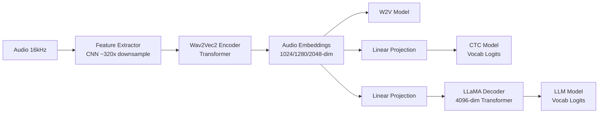

Explore the hierarchical architecture design of Omnilingual ASR models, built on the Wav2Vec2 encoder foundation.

## Architecture Overview

Omnilingual ASR models follow a hierarchical design with three main families:



<Tabs>
  <Tab title="W2V (Encoder)">
    **Wav2Vec2 Self-Supervised Learning**
    
    ```
    [Audio 16kHz] → Feature Extractor → Wav2Vec2 Encoder → [Audio Embeddings]
                    (CNN ~320x)         (Transformer)      (1024/1280/2048-dim)
    ```
    
    Foundation encoder producing rich contextualized audio representations.
  </Tab>
  
  <Tab title="CTC (Encoder + Projection)">
    **Connectionist Temporal Classification**
    
    ```
    [Audio 16kHz] → Feature Extractor → Wav2Vec2 Encoder → Linear → [Vocab Logits]
                    (CNN ~320x)         (Transformer)      Projection
    ```
    
    Parallel prediction with CTC alignment for fast inference.
  </Tab>
  
  <Tab title="LLM (Encoder-Decoder)">
    **Language Model with Encoder-Decoder Architecture**
    
    ```
    [Audio 16kHz] → Feature Extractor → Wav2Vec2 Encoder → Linear → LLaMA → [Vocab Logits]
                    (CNN ~320x)         (Transformer)      Projection  Decoder
    ```
    
    Autoregressive generation with language conditioning capabilities.
  </Tab>
</Tabs>

## Model Families

### W2V Models

Self-supervised learning models that serve as the foundation for all other architectures.

<CodeGroup>
```python Input/Output
# Input
raw_audio: Tensor  # Shape: [batch_size, audio_length], 16kHz waveform

# Output  
audio_embeddings: Tensor  # Shape: [batch_size, time_steps, embed_dim]
                          # embed_dim: 1024 (300M), 1280 (1B), 2048 (3B/7B)
```

```python Available Models
models = [
    "omniASR_W2V_300M",  # 1024-dim embeddings
    "omniASR_W2V_1B",    # 1280-dim embeddings
    "omniASR_W2V_3B",    # 2048-dim embeddings
    "omniASR_W2V_7B"     # 2048-dim embeddings
]
```
</CodeGroup>

**Architecture Components:**

<Steps>
  <Step title="Feature Extractor">
    CNN layers downsample raw audio by ~320x:
    - Input: 16kHz waveform
    - Output: Frame-level features (~50 fps)
    - Reduces sequence length for efficient processing
  </Step>
  
  <Step title="Transformer Encoder">
    Contextual encoding via multi-head self-attention:
    - Layers: 12 (300M), 24 (1B), 36 (3B), 48 (7B)
    - Attention heads: 16 (300M/1B), 32 (3B/7B)
    - Creates rich audio representations
  </Step>
</Steps>

**Key Features:**
- Pre-trained with self-supervised learning
- Contextual audio embeddings
- Foundation for CTC and LLM variants
- Ideal for building custom architectures

**Use Cases:**
- Starting point for fine-tuning
- Building custom ASR architectures
- Audio feature extraction
- Transfer learning applications

---

### CTC Models

Non-autoregressive models using Connectionist Temporal Classification for parallel prediction.

<CodeGroup>
```python Input/Output
# Input
raw_audio: Tensor  # Shape: [batch_size, audio_length], 16kHz

# Output
vocab_logits: Tensor  # Shape: [batch_size, time_steps, vocab_size]
                      # vocab_size: 9812 or 10288 tokens
```

```python Architecture Details
# From Wav2Vec2 embeddings to vocabulary
audio_embeddings: [batch, time, 1024/1280/2048]
    ↓ Linear projection
vocab_logits: [batch, time, 9812/10288]
    ↓ CTC decoding (parallel)
transcription: str
```
</CodeGroup>

**Architecture:**

```
Wav2Vec2 Encoder Output (1024/1280/2048-dim)
    ↓
Linear Projection Layer
    ↓
Vocabulary Logits (9812/10288 tokens)
    ↓
CTC Alignment & Decoding
    ↓
Final Transcription
```

<AccordionGroup>
  <Accordion title="CTC Alignment">
    CTC allows the model to predict multiple frames per character, then collapses repeated predictions:
    
    ```
    Raw predictions:  [h, h, e, e, l, l, l, o, o]
    After collapse:   [h, e, l, o]
    Final output:     "hello"
    ```
    
    Blank tokens (`<blank>`) separate repeated characters.
  </Accordion>
  
  <Accordion title="Vocabulary">
    - **Size**: 9812 or 10288 tokens depending on version
    - **Coverage**: 1600+ languages
    - **Tokenization**: Character-level or subword units
    - **Special tokens**: `<pad>`, `<unk>`, `<blank>`
  </Accordion>
</AccordionGroup>

**Advantages:**
- **Fast**: Parallel prediction (no autoregression)
- **Efficient**: Single forward pass
- **Lightweight**: Simple linear projection
- **On-device friendly**: Lower memory footprint

**Limitations:**
- No language conditioning
- No context example support
- Lower accuracy than LLM models

**Implementation:**

CTC models use fairseq2's existing implementations with updated configurations:
- Code: [fairseq2/models/wav2vec2](https://github.com/facebookresearch/fairseq2/tree/main/src/fairseq2/models/wav2vec2)
- Configs: Custom training data configurations

---

### LLM Models

Encoder-decoder architecture with LLaMA-based autoregressive decoder.

<CodeGroup>
```python Input/Output
# Standard Input
raw_audio: Tensor              # [batch, audio_length], 16kHz
lang_codes: List[str] | None   # Optional: ["eng_Latn", "deu_Latn", ...]

# Zero-Shot Input
raw_audio: Tensor
context_audio: List[Tensor]    # 10 context examples
context_text: List[str]        # Corresponding transcriptions

# Output
transcription: str             # Autoregressive beam search output
```

```python Architecture Flow
# Projection to LLaMA space
audio_embeddings: [batch, time, 1024/1280/2048]
    ↓ Linear projection
llama_input: [batch, time, 4096]
    ↓ + Language tokens (optional)
llama_input_conditioned: [batch, time+lang_tokens, 4096]
    ↓ LLaMA Transformer Decoder
decoder_output: [batch, seq_len, 4096]
    ↓ Output projection
vocab_logits: [batch, seq_len, 9812/9818/10288]
    ↓ Beam search
transcription: str
```
</CodeGroup>

**Architecture Components:**

<Steps>
  <Step title="Audio Encoder">
    Wav2Vec2 encoder produces audio embeddings
    - Output dimensions: 1024 (300M), 1280 (1B), 2048 (3B/7B)
  </Step>
  
  <Step title="Projection Layer">
    Linear projection to LLaMA decoder space
    - Projects to 4096 dimensions
    - Aligns audio with text representations
  </Step>
  
  <Step title="LLaMA Decoder">
    Autoregressive transformer decoder
    - Dimensions: 4096
    - Generates text tokens sequentially
    - Supports language conditioning and context
  </Step>
  
  <Step title="Beam Search">
    Decodes output logits to final transcription
    - Configurable beam width
    - Length normalization
    - Diverse beam search options
  </Step>
</Steps>

**Model Variants:**

<Tabs>
  <Tab title="LLM+LID (Language Conditioning)">
    Language-aware models with optional language ID conditioning.
    
    **Training Strategy:**
    - 80% samples with language ID tokens
    - 20% samples without language ID
    - Robust performance in both scenarios
    
    **Input Format:**
    ```python
    # With language conditioning
    [<lang:eng_Latn>] + audio_embeddings → decoder → "hello world"
    
    # Without language conditioning  
    audio_embeddings → decoder → "hello world"
    ```
    
    **Available Models:**
    - `omniASR_LLM_300M_v2`
    - `omniASR_LLM_1B_v2`
    - `omniASR_LLM_3B_v2`
    - `omniASR_LLM_7B_v2`
  </Tab>
  
  <Tab title="LLM+LID Unlimited Length">
    Extended models for transcribing unlimited-length audio.
    
    **Segmentation Strategy:**
    - Audio/text split into N=15 second segments
    - Decoder conditioned on previous M=1 segments
    - Iterative decoding with segment context
    
    **Architecture:**
    ```python
    # Segment 1
    audio_seg_1 → decoder → text_seg_1
    
    # Segment 2 (conditioned on segment 1)
    [audio_seg_1, text_seg_1, audio_seg_2] → decoder → text_seg_2
    
    # Segment 3 (conditioned on segment 2)
    [audio_seg_2, text_seg_2, audio_seg_3] → decoder → text_seg_3
    ```
    
    <Note>
      These models were released as an update and are not described in the original research paper. CER performance is on par with standard LLM+LID models.
    </Note>
    
    **Available Models:**
    - `omniASR_LLM_Unlimited_300M_v2`
    - `omniASR_LLM_Unlimited_1B_v2`
    - `omniASR_LLM_Unlimited_3B_v2`
    - `omniASR_LLM_Unlimited_7B_v2`
  </Tab>
  
  <Tab title="LLM+ZS (Zero-Shot)">
    In-context learning model for unseen languages.
    
    **Context Architecture:**
    - Requires exactly 10 context examples
    - Each example: audio-text pair
    - Context length: up to 30 seconds per example
    
    **Input Format:**
    ```python
    # Context examples (10 slots)
    context = [
        (audio_1, "transcription 1"),
        (audio_2, "transcription 2"),
        # ... 8 more examples
        (audio_10, "transcription 10")
    ]
    
    # Input composition
    [context_pairs] + target_audio → decoder → transcription
    ```
    
    <Warning>
      The model has an architectural constraint of exactly 10 context slots. If fewer examples are provided, they're duplicated to fill slots. If more are provided, they're cropped.
    </Warning>
    
    **Available Model:**
    - `omniASR_LLM_7B_ZS` (7B parameters only)
  </Tab>
</Tabs>

**Input Validation:**

The `Wav2Vec2LlamaModel` implementation performs input validation at every forward pass:

```python
# Validation via ensure_valid_forward_inputs()

if has_language_tokens and has_context:
    raise ValueError("Cannot use both language ID and context")
    
if has_context and len(context_examples) != 10:
    raise ValueError("Zero-shot requires exactly 10 context examples")
```

Additional inputs are encoded in the `.example` field of `Seq2SeqBatch` for flexibility.

**Vocabulary:**
- **Sizes**: 9812 / 9818 / 10288 tokens (variant-dependent)
- **Coverage**: 1600+ languages
- **Special tokens**: Language ID tokens, padding, unknown, etc.

## Model Size Comparison

<CardGroup cols={2}>
  <Card title="300M Parameters" icon="microchip">
    **Encoder:**
    - Embedding dim: 1024
    - Transformer layers: 12
    - Attention heads: 16
    
    **Best for:** Resource-constrained environments, mobile, edge devices
  </Card>
  
  <Card title="1B Parameters" icon="microchip">
    **Encoder:**
    - Embedding dim: 1280
    - Transformer layers: 24
    - Attention heads: 16
    
    **Best for:** Balanced accuracy/efficiency, general-purpose ASR
  </Card>
  
  <Card title="3B Parameters" icon="microchip">
    **Encoder:**
    - Embedding dim: 2048
    - Transformer layers: 36
    - Attention heads: 32
    
    **Best for:** High-accuracy requirements, multilingual scenarios
  </Card>
  
  <Card title="7B Parameters" icon="microchip">
    **Encoder:**
    - Embedding dim: 2048
    - Transformer layers: 48
    - Attention heads: 32
    
    **Best for:** Maximum accuracy, research, zero-shot learning
  </Card>
</CardGroup>

## Implementation Details

### fairseq2 Integration

All models leverage fairseq2's configuration system:

<CodeGroup>
```python W2V and CTC
# Existing fairseq2 implementations
from fairseq2.models.wav2vec2 import Wav2Vec2Model
from fairseq2.models.wav2vec2.asr import Wav2Vec2AsrModel

# With custom configs for Omnilingual training
model = load_model("omniASR_CTC_1B_v2")
```

```python LLM Models
# Custom implementation in this repository
from omnilingual_asr.models.wav2vec2_llama.model import Wav2Vec2LlamaModel

# Encoder-decoder architecture
model = load_model("omniASR_LLM_1B_v2")
```
</CodeGroup>

**Key Files:**
- W2V/CTC: [fairseq2/models/wav2vec2](https://github.com/facebookresearch/fairseq2/tree/main/src/fairseq2/models/wav2vec2)
- LLM: [wav2vec2_llama/model.py](https://github.com/facebookresearch/omnilingual-asr/blob/main/src/omnilingual_asr/models/wav2vec2_llama/model.py)
- Configs: [model asset cards](https://github.com/facebookresearch/omnilingual-asr/tree/main/src/omnilingual_asr/cards/models)

### Syntax and Grammar

LLM models use special syntax for different input combinations. The grammar is defined in `create_syntax()` functions:

<Accordion title="Syntax Examples">
```python
# Language-conditioned syntax
<lang:eng_Latn> <audio_tokens...> <text_tokens...>

# Zero-shot syntax with context
<context_1_audio> <context_1_text> 
<context_2_audio> <context_2_text>
# ... (10 context pairs)
<target_audio> <text_tokens...>
```

See [model.py](https://github.com/facebookresearch/omnilingual-asr/blob/main/src/omnilingual_asr/models/wav2vec2_llama/model.py) for full implementation.
</Accordion>

## Model Selection Guide

<Steps>
  <Step title="Determine Your Use Case">
    - **High throughput?** → CTC models
    - **Best accuracy?** → LLM models (3B/7B)
    - **Unseen languages?** → Zero-shot (7B ZS)
    - **Long audio?** → LLM Unlimited models
  </Step>
  
  <Step title="Consider Resource Constraints">
    - **Mobile/Edge?** → 300M CTC
    - **Server/Cloud?** → 1B/3B/7B LLM
    - **GPU memory?** → Smaller models for limited memory
  </Step>
  
  <Step title="Evaluate Language Requirements">
    - **Single language?** → CTC sufficient
    - **Multiple languages?** → LLM with language codes
    - **Rare languages?** → Zero-shot model
  </Step>
  
  <Step title="Test and Optimize">
    - Start with 1B model as baseline
    - Compare CTC vs LLM accuracy
    - Scale up/down based on results
  </Step>
</Steps>

## Next Steps

<CardGroup cols={2}>
  <Card title="Inference Guide" icon="play" href="/guides/inference">
    Learn how to use these models for transcription
  </Card>
  
  <Card title="Training Guide" icon="graduation-cap" href="/guides/training">
    Fine-tune models on your own data
  </Card>
  
  <Card title="Research Paper" icon="file-lines" href="https://ai.meta.com/research/publications/omnilingual-asr-open-source-multilingual-speech-recognition-for-1600-languages/">
    Read the full technical details
  </Card>
  
  <Card title="GitHub Repository" icon="github" href="https://github.com/facebookresearch/omnilingual-asr">
    Explore the source code
  </Card>
</CardGroup>